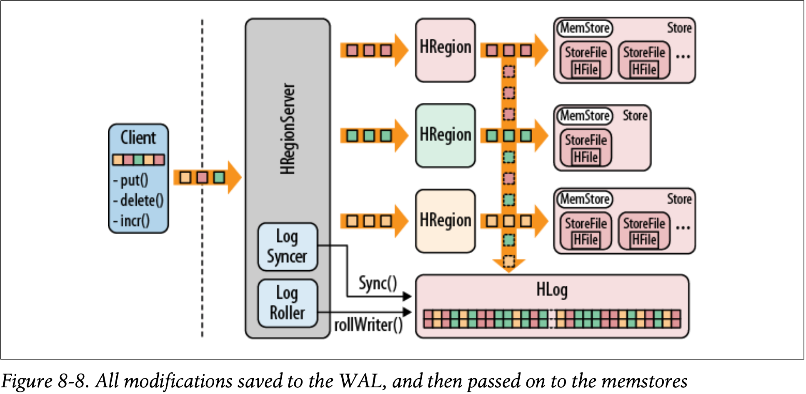

* Hbase architecture in details :
  * Please ref the image 
  * As image says : 
    * Each region server can have multiple HRegion, even though image does not specify. 
    * ```The HRegionServer opens the region and creates a corresponding HRegion object. When the HRegion is opened it sets up a Store instance for each HColumnFamily for every table as defined by the user beforehand. Each Store instance can, in turn, have one or more StoreFile instances, which are lightweight wrappers around the actual storage file called HFile. A Store also has a MemStore, and the HRegionServer a shared HLog in- stance ```
    * When a store file within a region grows larger than the configured hbase.hregion.max.filesize—or what is configured at the column family level using HColumnDescriptor—the region is split in two
      * The region server accomplishes this by creating the splits directory in the parent region
      * The region server then prepares the new daughter regions (using multiple threads) by setting up the necessary file structures inside the splits directory. This includes the new region directories and the reference files. If this process completes successfully, it moves the two new region directories into the table directory. The .META. table is updated for the parent to state that it is now split, and what the two daughter regions are. This prevents it from being reopened by accident.
  * Compactions :
    * Minor :
      * ```The store files are monitored by a background thread to keep them under control. The flushes of memstores slowly build up an increasing number of on-disk files. If there are enough of them, the compaction process will combine them to a few, larger files. This goes on until the largest of these files exceeds the configured maximum store file size and triggers a region split```
      * ```The maximum number of files to include in a minor compaction is set to 10, and is configured with hbase.hstore.compaction.max. The list is further narrowed down by the hbase.hstore.compaction.min.size (set to the configured memstore flush size for the region), and the hbase.hstore.compaction.max.size (defaults to Long.MAX_VALUE) configuration properties. Any file larger than the maximum compaction size is always excluded. The minimum compaction size works slightly differently: it is a threshold rather than a per-file limit. It includes all files that are under that limit, up to the total number of files per compaction allowed```
      * ```hbase.hstore.compaction.ratio , hbase.hstore.compaction.max.size ,hbase.hstore.compaction.max ``` 
        * These properties are used to fine tune the number of store files, 
          * based on file size, number of files, files are scan from old to new to be considered in minor compaction
    * Major :
      * major compactions compact all files into a single file 
      * Which compaction type is run is automatically determined when the compaction check is executed. The check is triggered either after a memstore has been flushed to disk
  * WAL(Write ahead logs): 
  * Please ref image : 
  * ```first the client initiates an action that modifies data. This can be, for example, a call to put(), delete(), and increment(). Each of these modifications is wrapped into a KeyValue object instance and sent over the wire using RPC calls. The calls are (ideally) batched to the HRegionServer that serves the matching regions. Once the KeyValue instances arrive, they are routed to the HRegion instances that are responsible for the given rows. The data is written to the WAL, and then put into the MemStore of the actual Store that holds the record. This is, in essence, the write path of HBase```