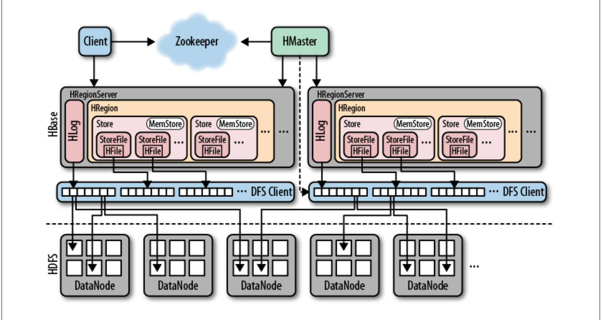

* Hbase architecture in details :
  * Please ref the image 
  * As image says : 
    * ```The HRegionServer opens the region and creates a corresponding HRegion object. When the HRegion is opened it sets up a Store instance for each HColumnFamily for every table as defined by the user beforehand. Each Store instance can, in turn, have one or more StoreFile instances, which are lightweight wrappers around the actual storage file called HFile. A Store also has a MemStore, and the HRegionServer a shared HLog in- stance ```
    * When a store file within a region grows larger than the configured hbase.hregion.max.filesize—or what is configured at the column family level using HColumnDescriptor—the region is split in two
      * The region server accomplishes this by creating the splits directory in the parent region
      *  The region server then prepares the new daughter regions (using multiple threads) by setting up the necessary file structures inside the splits directory. This includes the new region directories and the reference files. If this process completes successfully, it moves the two new region directories into the table directory. The .META. table is updated for the parent to state that it is now split, and what the two daughter regions are. This prevents it from being reopened by accident.