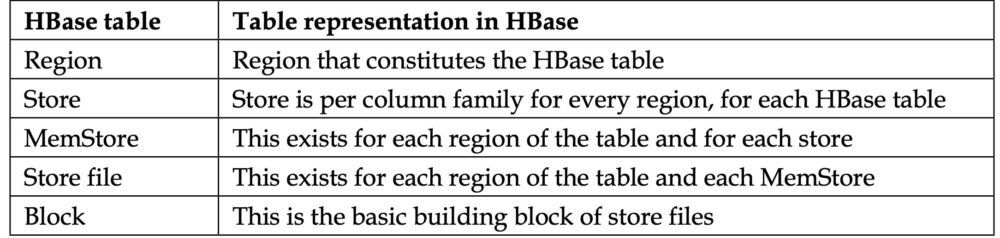
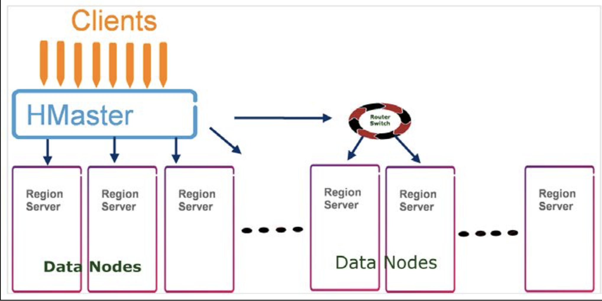
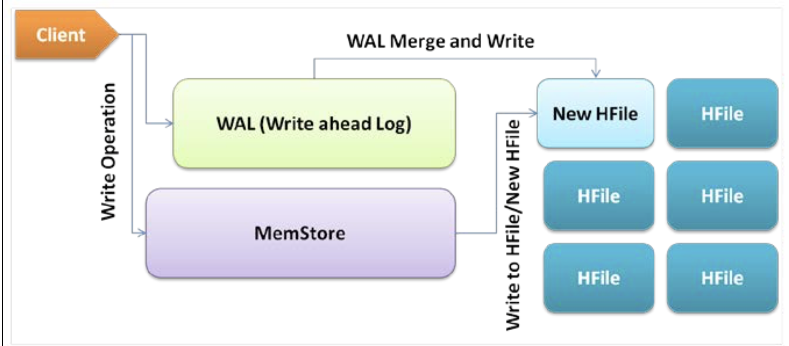

### Hbase and its components
* **HFile :**
  * HFile internally consists of HFile blocks that are its building blocks.
* **Region :**
  * blocks of RegionServers that provide distribution, availability, and storage for columns and column families on an HBase cluster
  
  * HDFS directory structure look like below 
    * /hbase
      * /table
        * /region
          * /column family
            * /store file
* **HLogs :**
  * files that save all edit logs to HStore files,it performs logfile rolling
  * one HLog file per RegionServer, and write-ahead (writing changes to a logfile and then performing the actual write) is performed on this **logfile for every region on a particular RegionServer**
### Scalability :
  * HBase scale out process, mean we can add more machine to scale the Hbase instead of scale up for more power machines
  * In HBase, we can always add a new Hadoop DataNode; on DataNodes, we can host many RegionServers for higher scalability
   
  * Add new RegionServers on the fly; for this, new DataNodes are added, the RegionServer daemon is started on these DataNodes, and scalability is obtained
  * Hbase nodes(Region servers), talk to each other via **RPC** calls, which make it like a local system as a one.
  * HBaseRPC is the class that facilitates HBase to use RPC among the components.
#### Flow Of Requests 
* For Read/Write operation
  * The client contacts ZooKeeper to find who the active HMaster is and what the location of the root RegionServer is
  * client communicates RegionServer  to read/write the table
* For Admin operations :
  * Client applications talk to HMaster in order to dynamically create a table, add a column family, and for other operations.
  * HMaster communicates to RegionServers to open, close, move, split, or flush the region
* Active HMaster data and the root RegionServer location are cached into ZooKeepers by HMaster
   
  * Client does not write data directly to HFiles
    * IT first write to WAL , then to MemStore, and MemStore is flush to HFile.
  * WAL(Write ahead logs)
    * Present per region server, store on HDFS so can be recovered 
    * In the case of a RegionServer crash where MemStore is not flushed, WAL is used to restore the data to a new RegionServer
      * only once data is written successfully to WAL and MemStore, the write operation is said to be successful
  * MemStore :
    * acts as an in-memory write buffer with a default size of 64 MB
      * Once it reach 40% of 64MD , it is flushed to HFile
    * HBase does not play a role in the underlying mechanism of block replication or dividing HFiles into blocks
    * Each column family might have many HFiles, but the HFile will only belong to a specific column family
#### Reading from HBase
* Client get Active HMaster from Zookeeper , then client initiates a read request , then 
  * client gets the RegionServer and region information, and it communicates this to the acquired RegionServer
  * acquired RegionServer, the client first tries to read from MemStore
  * if it's a miss, it navigates to block cache
  * If there is a missing record, the corresponding HFile is loaded into the memory that contains the required row of data
* **Block cache**
  * least recently used (LRU) cache
  * Every RegionServer has a single block cache that keeps the most frequently accessed data from HFile in the main memory
