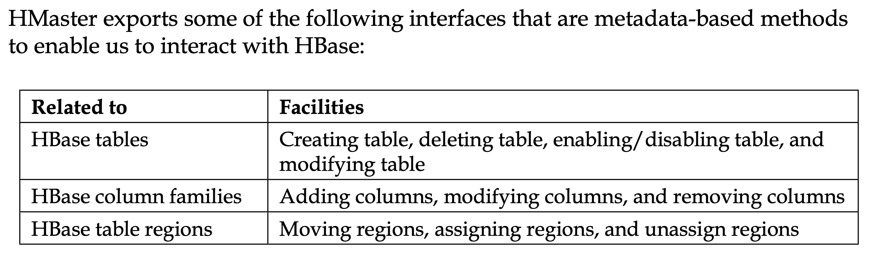
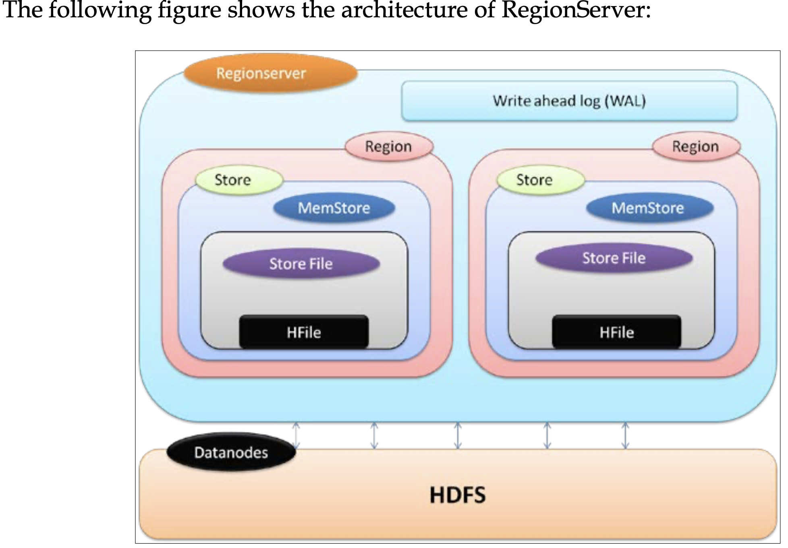

## What is Hbase 
* HBase is a column-based database that runs on top of Hadoop distributed file system and 
  * Support features such as linear scalability (scale out), automatic failover, automatic sharding, and more flexible schema
* How Hbase comes into picture :
  * ``` 
    Consider that we have got a CSV file stored on HDFS and we need to query from it. 
    We would need to write a Java code for this, which wouldn't be a good option. 
    It would be better if we could specify the data key and fetch the data from that file. 
    So, what we can do here is create a schema or table with the same structure of CSV file to store the data of the CSV file in the HBase table and query using HBase APIs, 
    or HBase shell using key.
    ```
* In HBase, there is a table called .META. (table name on file system), which keeps all information about regions that is referred by HMaster for information about the data. By default, HMaster runs on port number 60000 and its HTTP Web UI is available on port 60010, which can always be changed according to our need.
    
* Region Server :
  * RegionServers store the raw actual data. As you might guess, a RegionServer is run or is hosted on top of a DataNode(HDFS)
  
  * Write-Ahead logs : 
    * When data is read/modified to HBase, it's not directly written in the disk rather it is kept in memory for some time
    * Keeping this data in memory may result in a loss of data if the machine goes down abruptly , data is first written in an intermediate file, which is called Write-Ahead logfile
  * HFile: These are the actual files where the raw data is stored physically on the disk. This is the actual store file.
  * Store: Here the HFile is stored. It corresponds to a column family for a table in HBase.
  * MemStore: This component is in memory data store; this resides in the main memory and records the current data operation. So, when data is stored in WAL, RegionServers stores key-value in memory store.
  * Region: These are the splits of HBase table; the table is divided into regions based on the key and are hosted by RegionServers. There may be different regions in a RegionServer.
* Client is responsible for finding the RegionServer, which is hosting the particular row (data). It is done by querying the catalog tables
* **Catalog tables** :
  * two tables that maintain the information about all RegionServers and regions
  * -ROOT-: This includes information about the location of .META. table
  * .META.: This table holds all regions and their locations
