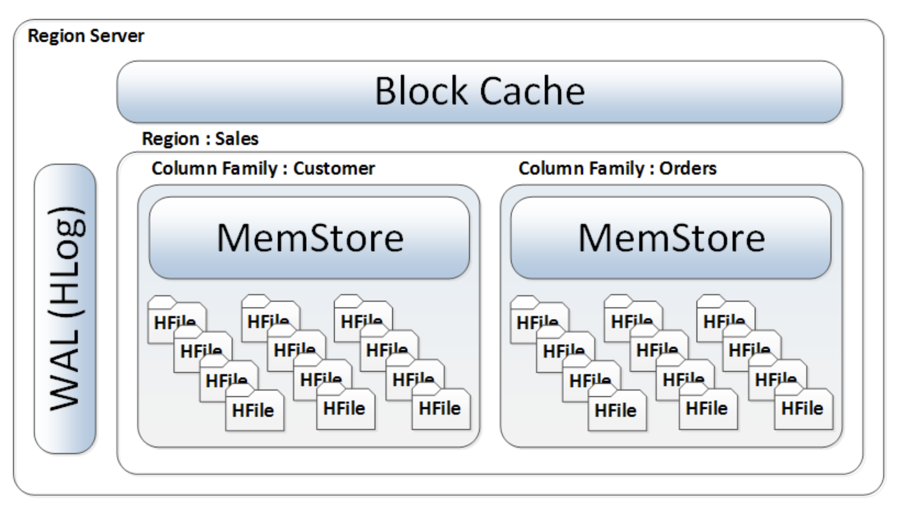
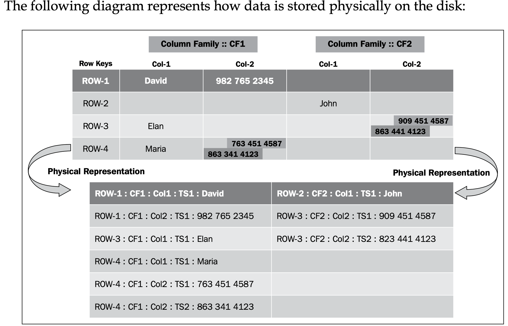

### Table design in HBase

* Above picture says alot about the internal of Region Server
* Read first : https://github.com/AnkushNakaskar/Hbase_installation/blob/main/README.md#hbase-request-flow--most-important-to-understand-hbase-internal-structure
  * It explains the storage of table and column family in Hbase.

#### Understanding keys
* **Row Key**: This provides a logical representation of an entire row, containing all the column families and column qualifiers
* **Column Key**: This is formed by combining the column family and the column qualifier
* the data within multiple versions of the same cell is also stored as a separate linear set of cells and a timestamp is added, along with the cell data stored
* **These linear sets of cells are sorted in descending order by their timestamp so that the HBase client always fetches the most recent value of the cell data**

* Focus on row4 , TS : time-stamp
